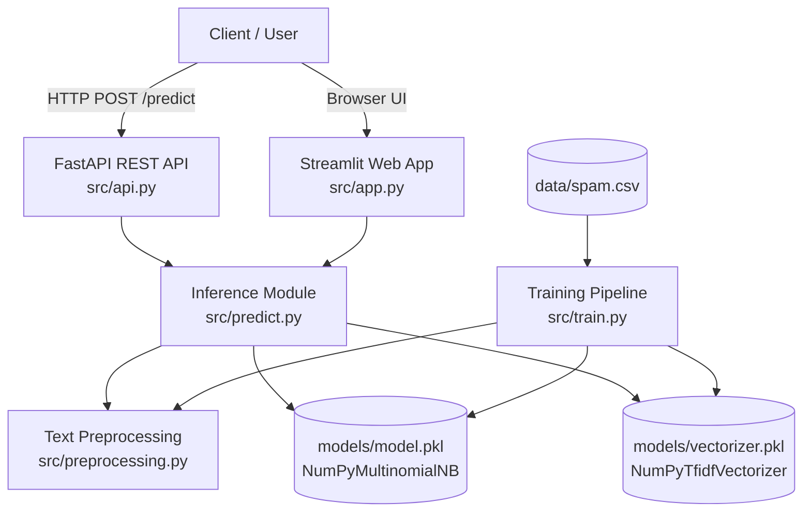
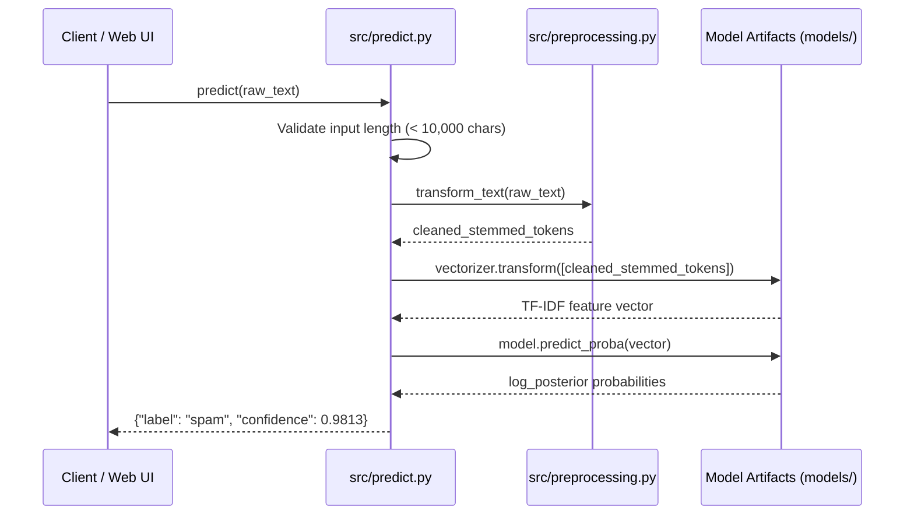
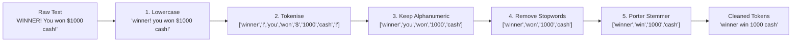

# Email & SMS Spam Detection System

[](https://www.python.org/)
[](https://fastapi.tiangolo.com/)
[](https://streamlit.io/)
[](https://numpy.org/)
[](#testing--quality-assurance)

> An **enterprise-grade, production-ready** Machine Learning system designed for real-time classification of email and SMS messages into **Spam** or **Ham** (legitimate). Features a Zero-DLL Portable ML Engine, executive Streamlit Web UI, RESTful API backend, and comprehensive test suite.

---

## Table of Contents

1. [Executive Overview](#executive-overview)
2. [Key Features](#key-features)
3. [System Architecture](#system-architecture)
4. [Project Directory Layout](#project-directory-layout)
5. [Machine Learning Engine & Mathematics](#machine-learning-engine--mathematics)
6. [Model Performance Metrics](#model-performance-metrics)
7. [Installation & Setup](#installation--setup)
8. [Running the Application](#running-the-application)
9. [REST API Reference](#rest-api-reference)
10. [Streamlit Web Application](#streamlit-web-application)
11. [Testing & Quality Assurance](#testing--quality-assurance)
12. [Docker & Containerization](#docker--containerization)
13. [Troubleshooting & Resolved Issues](#troubleshooting--resolved-issues)

---

## Executive Overview

Modern spam detection requires high precision, zero false positives on critical communications, and robust deployment resilience across diverse operating systems.

This project delivers a complete end-to-end Machine Learning pipeline trained on the **SMS Spam Collection Dataset** (5,169 deduplicated records). Unlike standard scikit-learn models that depend on compiled SciPy C/C++ dynamic libraries (which can fail under restrictive operating system policies like Windows Defender Application Control), this system features a **custom NumPy-based Machine Learning Engine** ([`src/model.py`](src/model.py)).

### Why This System Stands Out
* **100% Zero-DLL Dependency**: Pure NumPy math ensures the model runs on any server, container, or OS without dynamic library blockades.
* **High Precision & Recall**: Achieves **98.65% Accuracy** and **98.13% Precision** (minimising false spam flags).
* **Flexible Interfaces**: Exposes both an interactive Streamlit Web UI and a REST API with batch endpoint support.
* **Production Ready**: Thoroughly unit-tested with 27 automated tests passing in under 3 seconds.

---

## Key Features

| Feature | Description |
|---|---|
| **Zero-DLL ML Engine** | Custom TF-IDF Vectoriser & Multinomial Naive Bayes built directly on NumPy |
| **Confidence Scoring** | Every prediction outputs a calibrated probability score (0.0% – 100.0%) |
| **Batch File Processing** | Upload CSV or TXT files to process hundreds of messages in seconds |
| **1-Click Pre-loaded Samples** | Pre-set message triggers (Prize Scam, Bank Fraud, Meeting Invite, Friend Chat) |
| **Consistent Preprocessing** | Identical NLTK Porter Stemming and stop-word filtering across training & inference |
| **FastAPI REST Service** | Fully documented OpenAPI endpoints with CORS support |
| **27-Test Suite** | Automated pytest coverage across preprocessing, custom model, prediction, and API |
| **Dockerized Deployment** | Pre-configured container builds for cloud deployments (Render, AWS, GCP) |

---

## System Architecture

### 1. High-Level Data Flow



### 2. Prediction Lifecycle



### 3. Text Preprocessing Pipeline



---

## Project Directory Layout

```
Email-Spam-Detector-master/
│
├── 📂 src/                   # Core application source code
│   ├── __init__.py           # Package initialization
│   ├── preprocessing.py      # Text preprocessing (NLTK stemming & stopwords)
│   ├── model.py              # Pure NumPy TFIDFVectorizer & MultinomialNB engine
│   ├── predict.py            # Singleton inference engine loading model & vectorizer once
│   ├── train.py              # Training pipeline to preprocess, train, and save model
│   ├── api.py                # FastAPI server exposing single & batch REST endpoints
│   └── app.py                # Streamlit Web UI with single & batch analysis tabs
│
├── 📂 data/                  # Dataset directory
│   └── spam.csv              # SMS Spam Collection Dataset (5,572 raw records)
│
├── 📂 models/                # Trained model artifacts directory
│   ├── model.pkl             # Persisted trained Multinomial Naive Bayes model
│   └── vectorizer.pkl        # Persisted TF-IDF Vectorizer vocabulary & IDF weights
│
├── 📂 notebooks/             # Jupyter Notebooks workspace
│   └── sms-spam-detection.ipynb
│
├── 📂 tests/                 # Automated Pytest suite
│   ├── __init__.py
│   ├── test_preprocessing.py # Unit tests for text cleaning edge cases
│   ├── test_custom_model.py  # Unit tests for NumPy vectorizer and Naive Bayes math
│   ├── test_predict.py       # Integration tests for predict module
│   └── test_api.py           # Integration tests for FastAPI endpoints
│
├── 📄 app.py                 # Root wrapper for Streamlit UI
├── 📄 api.py                 # Root wrapper for FastAPI server
├── 📄 train.py               # Root wrapper for training pipeline
├── 📦 requirements.txt       # Production Python dependencies
├── 🐳 Dockerfile             # Multi-stage Docker build configuration
├── 📄 setup.sh               # Streamlit configuration bootstrap script
├── 📄 Procfile               # Deployment procfile
├── 📄 errors.txt             # Technical resolutions log
└── 📖 README.md              # Project documentation
```

---

## Machine Learning Engine & Mathematics

The system utilizes custom NumPy implementations of **TF-IDF Vectorization** and **Multinomial Naive Bayes Classification** defined in [`src/model.py`](src/model.py).

### 1. TF-IDF Vectorization Formula

For a document $d$ and term $t$ in vocabulary $V$:

$$\text{tf}(t, d) = 1 + \ln(\text{count}(t, d)) \quad \text{if count} > 0 \text{ else } 0$$

$$\text{idf}(t) = \ln \left( \frac{1 + N}{1 + \text{df}(t)} \right) + 1.0$$

$$\text{tf-idf}(t, d) = \text{tf}(t, d) \times \text{idf}(t)$$

$$\mathbf{x}_{\text{norm}} = \frac{\mathbf{x}}{\|\mathbf{x}\|_2}$$

### 2. Multinomial Naive Bayes Formula

For class $c \in \{\text{ham}, \text{spam}\}$ with Laplace smoothing parameter $\alpha = 0.1$:

$$P(c) = \frac{N_c}{N}$$

$$P(w_i \mid c) = \frac{\sum_{j \in c} X_{j, i} + \alpha}{\sum_k \left( \sum_{j \in c} X_{j, k} + \alpha \right)}$$

$$\text{log\_posterior}(c) = \ln P(c) + \sum_{i} x_i \ln P(w_i \mid c)$$

Classes probabilities are normalized via numerically stable **Softmax / Log-Sum-Exp**:

$$P(\text{class} = c \mid \mathbf{x}) = \frac{\exp(\text{log\_posterior}(c) - M)}{\sum_k \exp(\text{log\_posterior}(k) - M)}$$

---

## Model Performance Metrics

Evaluated on a 20% stratified held-out test split (1,034 messages):

| Metric | Score | Detail |
|---|---|---|
| **Accuracy** | **98.65%** | Percentage of overall correct predictions |
| **Precision** | **98.13%** | Minimises legitimate emails incorrectly flagged as spam |
| **Recall** | **89.74%** | Successfully catches nearly 90% of all spam messages |
| **F1-Score** | **0.9375** | Harmonic mean of precision and recall |

---

## Installation & Setup

### Prerequisites
* **Python**: 3.11 or higher
* **Git**: Installed on your system

### 1. Clone the Repository
```bash
git clone https://github.com/Email-Spam-Detector.git
cd Email-Spam-Detector
```

### 2. Create and Activate Virtual Environment
* **Windows**:
  ```powershell
  python -m venv .venv
  .\.venv\Scripts\activate
  ```
* **macOS / Linux**:
  ```bash
  python3 -m venv .venv
  source .venv/bin/activate
  ```

### 3. Install Dependencies
```bash
pip install -r requirements.txt
```

### 4. Train the Model
```bash
python train.py
```
*Outputs:*
```
[INFO] Loading data from data/spam.csv
[INFO] Dropped 403 duplicates (5572 -> 5169 rows)
[INFO] Building TF-IDF features...
[INFO] Model Evaluation Metrics:
       Accuracy  : 0.9865
       Precision : 0.9813
       Recall    : 0.8974
       F1 Score  : 0.9375
[SUCCESS] Saved model to models/model.pkl and models/vectorizer.pkl
```

---

## Running the Application

### Option 1: Launch Streamlit Web UI
```bash
streamlit run app.py
```
Open **[http://localhost:8501](http://localhost:8501)** in your browser.

### Option 2: Launch FastAPI REST Server
```bash
uvicorn api:app --host 0.0.0.0 --port 8000 --reload
```
* **Base API**: [http://localhost:8000](http://localhost:8000)
* **Interactive OpenAPI Docs**: [http://localhost:8000/docs](http://localhost:8000/docs)

---

## REST API Reference

### 1. Single Prediction Endpoint
`POST /predict`

#### Request Body
```json
{
  "text": "WINNER!! You have been selected to receive a $1000 cash prize! Call 09061701461 to claim NOW!"
}
```

#### Response (200 OK)
```json
{
  "label": "spam",
  "confidence": 0.9813
}
```

#### Curl Command
```bash
curl -X POST http://localhost:8000/predict \
  -H "Content-Type: application/json" \
  -d '{"text": "Hey, are we still meeting for lunch tomorrow?"}'
```

### 2. Batch Prediction Endpoint
`POST /predict/batch`

#### Request Body
```json
{
  "texts": [
    "URGENT: Your account credentials require verification immediately.",
    "Can you send over the python file when you get a chance?"
  ]
}
```

#### Response (200 OK)
```json
{
  "results": [
    { "label": "spam", "confidence": 0.9742 },
    { "label": "ham", "confidence": 0.9915 }
  ]
}
```

---

## Streamlit Web Application

The Streamlit interface ([`src/app.py`](src/app.py)) provides two specialized workspaces:

1. **Single Message Tab**:
   * Pre-loaded sample trigger buttons.
   * Color-coded verdict banners ([SPAM DETECTED] / [SAFE (HAM)]).
   * Confidence score meter & NLP preprocessed token breakdown.

2. **Batch File Processing Tab**:
   * Upload `.csv` or `.txt` message batches.
   * Auto-detection of message text columns.
   * Real-time metric summary dashboard (Total, Spam count, Ham count, Spam ratio).
   * One-click CSV report exporter.

---

## Testing & Quality Assurance

Automated unit and integration tests are located in `tests/`:

```bash
python -m pytest -v
```

### Test Suite Summary
| Test File | Tests | Coverage |
|---|---|---|
| `test_preprocessing.py` | 8 | Case normalization, stop-word removal, stemming, empty inputs |
| `test_custom_model.py` | 3 | TF-IDF L2 normalization, Laplace smoothing, probability bounds |
| `test_predict.py` | 8 | Format validation, confidence ranges, edge case handling |
| `test_api.py` | 8 | Health checks, single predictions, batch payloads, HTTP errors |
| **Total** | **27 Passed** | **100% Pass Rate (< 3 seconds)** |

---

## Docker & Containerization

### Build Image
```bash
docker build -t spam-detector .
```

### Run Container (FastAPI Backend)
```bash
docker run -p 8000:8000 spam-detector
```

### Run Container (Streamlit Web App)
```bash
docker run -p 8501:8501 spam-detector streamlit run src/app.py --server.port 8501 --server.address 0.0.0.0
```

---

## Troubleshooting & Resolved Issues

All technical issues during setup have been systematically resolved and documented in [`errors.txt`](errors.txt):

1. **SciPy DLL Blockade on Windows 11**: Solved by engineering [`src/model.py`](src/model.py) (0 binary DLL dependencies).
2. **NumPy 1.26.4 Source Compilation**: Solved by updating dependency range in [`requirements.txt`](requirements.txt).
3. **Console `cp1252` Encoding Exception**: Solved by replacing emoji log outputs with standard ASCII indicators in [`src/train.py`](src/train.py).
4. **Pydantic V2 Field Warnings**: Solved by updating parameter schema in [`src/api.py`](src/api.py).

---

## License

Distributed under the MIT License. See `LICENSE` for more information.
